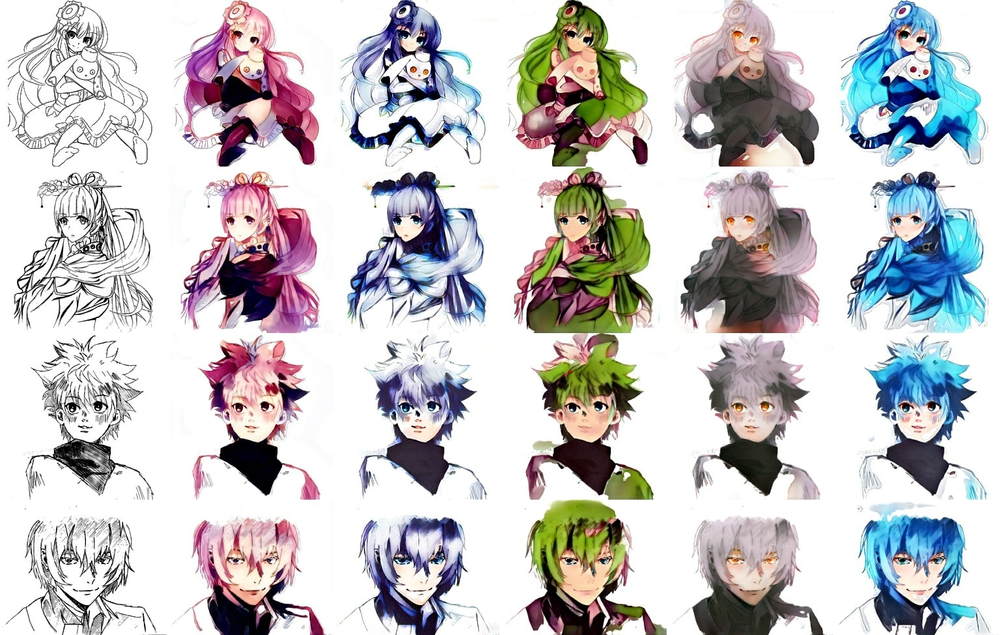

# CycleGANime
Automatic lineart colorization with [CycleGAN](https://junyanz.github.io/CycleGAN/)

Demo: [cycleganime.drew.hu](https://cyclegan.drew.hu) \
Blog post: [blog.drew.hu/cycleganime](https://blog.drew.hu/cycleganime)



## Dependencies
Tested on Ubuntu 20.04, 2080ti, Python 3.8, Pytorch 1.5, CUDA 10.2
* PyTorch + torchvision
* OpenCV


## Building the dataset
Images were downloaded from [Safebooru](), which is a safe-for-work anime/manga drawing archive. Just specify which image tags you want to download as well as the number of workers in `download_images.py` and run the file.

The dataset folder structure should look like this:
```
path/to/your/dataset/
├── testA/ 
│   ├── image1.jpg
│   ├── image2.jpg
│   └── image3.jpg
├── testB/ 
├── trainA/
└── trainB/
```

The `A` folders contain lineart images and the `B` folders contain colored images.

## Training
To train, modify the training options in `train.py` then run `python train.py`. 

With a dataset of ~1,000 256x256 images, batch size 1, training takes ~300s per epoch.

## Training tips
* Once the model starts to converge, results can vary greatly depending on the last few images it was fed. Either save results+models often and pick your favorite, or try fine-tuning at the end of training.

* If you're running out of GPU memory, specify a `CROP_SIZE` which is small enough to fit.

* Make sure to monitor the losses of your networks (generator A/B, discriminator A/B) and make sure they're balanced. For example, if the discriminator loss converges too quickly, try one of: 
  * Increasing the generator learning rate
  * Decreasing the discriminator learning rate
  * Removing a layer or two from the discriminator
  * The list goes on. For more tips and tricks, see Soumith Chintala's [How to train a GAN?](https://github.com/soumith/ganhacks).

  But even then, loss doesn't really tell you how well your model is doing, so make sure to have a set of images to validate your model with.

## Pretrained models
Coming soon
<!-- Pretrained models: [Download (45.5MB)](https://files.drew.hu/cycleganime_model.zip) -->


## References
Code is based on the original [CycleGAN PyTorch implementation](https://github.com/junyanz/pytorch-CycleGAN-and-pix2pix). 

Inspired by Kevin Frans' [DeepColor](https://github.com/kvfrans/deepcolor), which was inspired by [PaintsChainer](https://github.com/pfnet/PaintsChainer)(now Petalica Paint).

