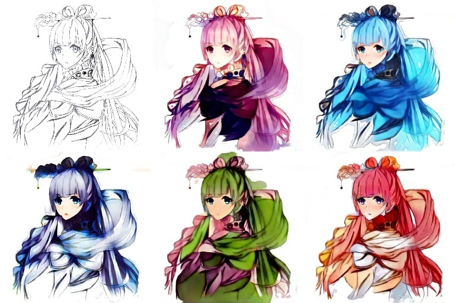
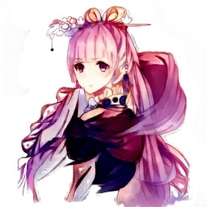
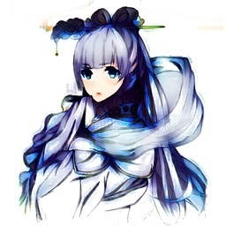
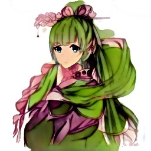
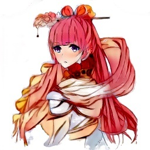
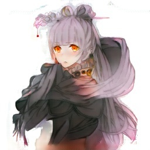
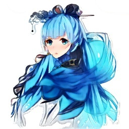

# CycleGANime
Automatic lineart colorization with [CycleGAN](https://junyanz.github.io/CycleGAN/).
Built to color some of [my friend's lineart](https://instagram.com/kuronaken).

Demo: [cycleganime.drew.hu](https://cycleganime.drew.hu) (not running anymore) \
Blog post: [blog.drew.hu/cycleganime](https://blog.drew.hu/cycleganime)



## Dependencies
Tested on, Ubuntu 20.04, Python 3.8, Pytorch 1.5, CUDA 10.2
* PyTorch + torchvision
* OpenCV

## Dataset
Images were downloaded from [Safebooru](https://safebooru.org/), which is a "safe-for-work" anime/manga drawing archive. Just specify which image tags you want to download as well as the number of workers in `download_images.py` and run the file.

The dataset folder structure should look like this:
```
path/to/your/dataset/
├── testA/ 
│   ├── image1.jpg
│   ├── image2.jpg
│   └── image3.jpg
├── testB/ 
├── trainA/
└── trainB/
```

The `A` folders contain lineart images and the `B` folders contain colored images.

## Training
To train, modify the training options in `train.py` then run `python train.py`. 

* Once the model starts to converge, results can vary greatly based on the last few batches,  so save results+models often and pick your favorite.

* If you're running out of GPU memory, specify a `CROP_SIZE` which is small enough to fit in GPU memory.

* Make sure to monitor the losses of your networks (generator A/B, discriminator A/B) and make sure they're balanced. For example, if the discriminator loss converges too quickly, try one of: 
  * Increasing the generator learning rate
  * Decreasing the discriminator learning rate
  * Removing a layer or two from the discriminator
  * The list goes on. For more tips and tricks, see Soumith Chintala's [How to train a GAN?](https://github.com/soumith/ganhacks).

  But even then, loss doesn't really tell you how well your model is doing, so make sure to have a set of images to validate your model with.

## Pretrained models
The pretrained models are each ~300MB since I used 128 conv filters (which I now regret because it was probably unnecessary
and increases server requirements), but there should be little problem running the model on a local machine.


| |  |  | 
:-------------------------:|:-------------------------:|:-------------------------:|
|[Download](https://files.drew.hu/cycleganime/models/256_15_128/aqua.pth) |[Download](https://files.drew.hu/cycleganime/models/256_15_128/ice.pth)  |[Download](https://files.drew.hu/cycleganime/models/256_15_128/elf.pth)  |


|  |  |  | 
:-------------------------:|:-------------------------:|:-------------------------:|
|[Download](https://files.drew.hu/cycleganime/models/256_15_128/red.pth) |[Download](https://files.drew.hu/cycleganime/models/256_15_128/smoke.pth)  |[Download](https://files.drew.hu/cycleganime/models/256_15_128/aqua.pth)  |

## Deployment
The frontend site was built with Vue and the backend was built as a Flask microservice using Redis as a task queue.
A serverless solution may be more cost-effective, but I haven't explored it yet.

## Credits
Code is based on the original [CycleGAN PyTorch implementation](https://github.com/junyanz/pytorch-CycleGAN-and-pix2pix). 

Inspired by Kevin Frans' [DeepColor](https://github.com/kvfrans/deepcolor), which was inspired by [Petalica Paint](https://petalica-paint.pixiv.dev/index_en.html).

